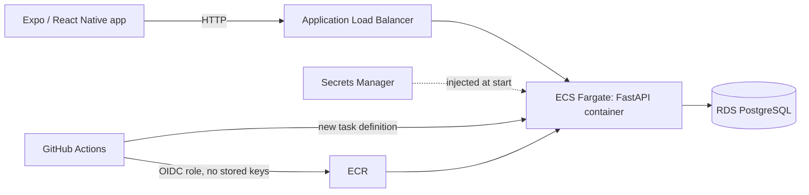

# BookLocal

A booking platform for local businesses (barbers, salons). Customers register, see a business's available slots and book or cancel appointments from a mobile app. The backend runs on AWS and is deployed automatically from GitHub.

Built as an end-to-end cloud project: API, database, infrastructure as code, CI/CD and a mobile client.

## Architecture



| Layer | Tech |
|-------|------|
| Mobile | React Native, Expo, TypeScript |
| API | FastAPI, SQLAlchemy 2, Alembic migrations, JWT auth (bcrypt) |
| Database | PostgreSQL 16 on RDS (private, reachable only from the ECS security group) |
| Compute | Docker image on ECS Fargate behind an ALB with `/health` checks |
| Secrets | AWS Secrets Manager, injected into the task definition |
| IaC | Terraform (networking, security groups, RDS, ALB, ECS, IAM, GitHub OIDC) |
| CI/CD | GitHub Actions: build, push to ECR, deploy to ECS on every push to `main` touching `backend/**` |

## Features

- Register / log in (JWT)
- Available slots computed from business hours, service duration and existing bookings
- Book a slot, with conflict protection: row locking (`SELECT ... FOR UPDATE`) prevents double-booking under concurrent requests
- My Bookings list and cancel (users can only see and cancel their own; cancelling frees the slot)

## API

| Method | Path | Auth | Description |
|--------|------|------|-------------|
| GET | `/health` | no | Health check for the load balancer |
| POST | `/register` | no | Create account |
| POST | `/login` | no | Returns access token |
| GET | `/businesses/{id}/available-slots` | no | Slots for a service on a date |
| POST | `/bookings` | yes | Book a slot |
| GET | `/bookings` | yes | List the current user's bookings |
| DELETE | `/bookings/{id}` | yes | Cancel own booking |

## Security decisions

- No long-lived AWS keys in CI: GitHub Actions assumes an IAM role through OIDC, with the trust policy scoped to this repository, branch and workflow
- Database credentials live in Secrets Manager, not in code
- RDS is only reachable from the application's security group
- Passwords are bcrypt-hashed; booking and cancel endpoints are scoped to the authenticated user

## Testing

14 pytest tests run against an isolated PostgreSQL test database: auth, booking success, business-hours rejection, conflict rejection, listing, cancelling, ownership checks and auth-required checks.

```bash
cd backend
source venv/bin/activate
python -m pytest -q
```

## Repo layout

```
backend/           FastAPI app, models, Alembic migrations, tests, Dockerfile
mobile/            Expo / React Native app
infrastructure/    Terraform for the AWS stack
.github/workflows/ CI/CD pipeline
```

## Known limitations / next steps

- Served over HTTP (no custom domain yet); next step is a domain, an ACM certificate and an HTTPS listener on the ALB
- Single seeded business in the mobile app; no business-owner dashboard yet
- Auth is custom JWT; Amazon Cognito is a candidate replacement